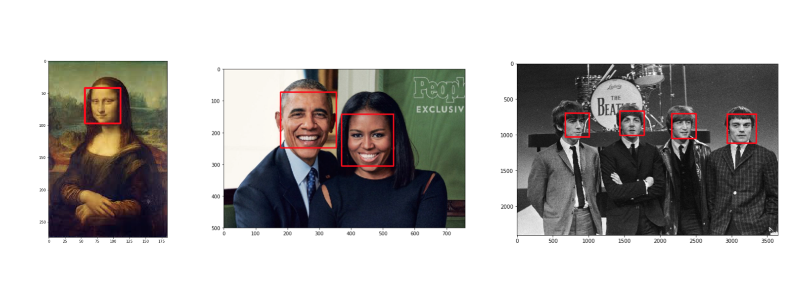

# Facial_Key_Features_detection

## Project Overview

This repository is made up of files form the [Udacity](https://www.udacity.com/course/computer-vision-nanodegree--nd891)
Computer Vision, Nanodegree. This project explores fundamental knowledge of Deep Learning Architectures and Image processing techniques
to construct a model that detects facial keypoints (68 in total) around the eyes, nose, mouth and the over all shape of the face. 
This project is fundamental to emotion recognition, facial tracking, facial pose recognition, and facial filters.

## Examples
+ **Detect all faces using Haar Cascade Classifiers using OpenCV**

  
 

+ **Detect facial keypoint with a Convolutional Neural Network**

  

### Local Environment Instructions

    conda create -n cv-nd python=3.6
    source activate cv-nd
    conda install pytorch torchvision cuda91 -c pytorch
    pip install -r requirements.txt

## Download the data

    wget -P ./data/ https://s3.amazonaws.com/video.udacity-data.com/topher/2018/May/5aea1b91_train-test-data/train-test-data.zip
    cd data
    unzip train-test-data.zip
    rm train-test-data.zip

## Project Structure
The project will be broken up into a few main parts in four Python notebooks:
#### `models.py`
__Notebook 1__ : Loading and Visualizing the Facial Keypoint Data

__Notebook 2__ : Defining and Training a Convolutional Neural Network (CNN) to Predict Facial Keypoints

__Notebook 3__ : Facial Keypoint Detection Using Haar Cascades and your Trained CNN

__Notebook 4__ : Fun Filters and Keypoint Uses

## Licence
This project is licensed under the terms of the 
